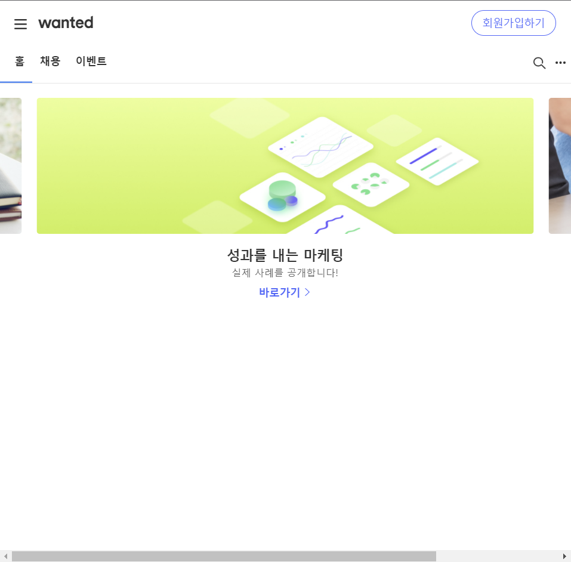

# 선발과제 [사이트](https://wantedpreonboarding.netlify.app/)

## 서비스 소개
* 원티드 홈페이지의 GNB영역과 캐러셀영역을 반응형으로 웹 구현

## 사용법
* 파일 전체다운로드후 npm i를 해서 node-module을 설치후 사용

## 사용기능
* GNB영역 : HTML과 CSS사용
* 캐러셀 : react-slick사용

## 사이트화면

	
1200~px

	

	

	
1100px~1200px

	

	

	
991px~1100px

	

	

	
767px~991px

	

	

	
~767px

	

	

